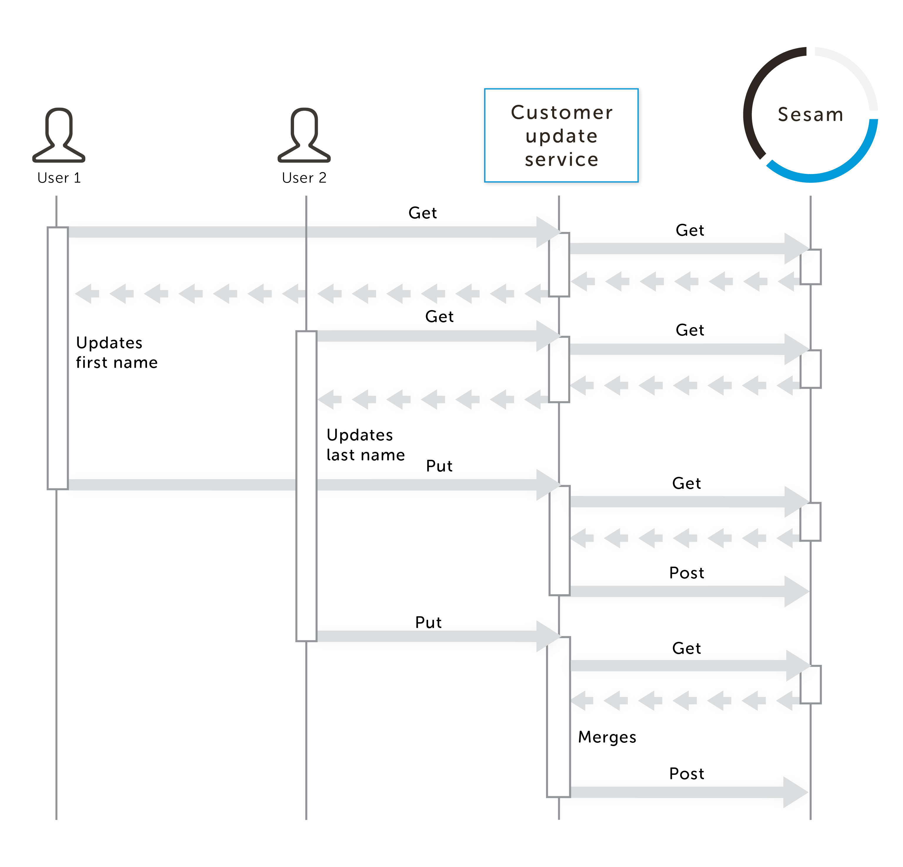

================================
sesam-concurrent-updates-example
================================

How Sesam allows you to handle conflict resolution
==================================================

When you store data in `Sesam <https://www.sesam.io/>`_, Sesam will by default keep a history of all the changes to your data. You can configure
Sesam to do "log compaction" if you only want to keep history for a certain period of time (e.g. two weeks of history).

All data coming out of Sesam contains a version number. It is a good practice to hold on to that version number while you modify that piece of data. This
allows you to implement automatic conflict resolution when multiple users are modifying data concurrently.

This example implements a simple `three-way merge algorithm <https://en.wikipedia.org/wiki/Merge_(version_control)#Three-way_merge>`_.
The algorithm could be extended to support deleted attributes, nested structures, rules for handling lists, etc.

The customer update scenario
============================

An example that uses Sesam to implement conflict resolution when you have concurrent updates of data.

- ``customer-update-service.py``: A stateless service that provides a REST API on top of Sesam with conflict resolution. Stores and retrieves data using Sesam.

Before you can start the application you will need to setup Sesam to run on ``http://localhost:9042``.

::

  ## upload sesam config
  $ sesam import sesam.conf.json
  ## we post some sample customers so that we can play with one of themI
  $ curl -XPOST localhost:9042/api/receivers/customers/entities -d @samples/customers.json -H "Content-Type: application/json"

You can now build and run ``customer-update-service.py`` with Docker:

::

    ## build the image
    $ docker build -t customer-update-service .
    ## start the container
    $ docker run -p 5000:5000 --net host customer-update-service
     * Running on http://0.0.0.0:5000/ (Press CTRL+C to quit)

Note: You can also run the service outside Docker if you have a Python 3 environment using ``$ python3 app/customer-update-service.py``

The scenario is a simple "customer" application. You can retrieve an existing customer, update the customer or create new customers. If two users modifies the same customer concurrently,
the service will try to resolve the conflicts automatically using the history provided by Sesam.

    A sequence diagram showing where and when the conflict resolution is done.

Example interaction with the application:

::

   ## let us perform some concurrent modifications
   $ curl 'http://localhost:5000/customers/baard' > baard-a.json
   $ curl 'http://localhost:5000/customers/baard' > baard-b.json
   ## What happens if both try to change the same field?
   $ sed -i 's/Baard/Brad/' baard-a.json
   $ sed -i 's/Baard/Bird/' baard-b.json
   $ curl -XPUT 'http://localhost:5000/customers/baard' -H "Content-type: application/json" -d @baard-a.json
   ## The first update went through
   $ curl -XPUT 'http://localhost:5000/customers/baard' -H "Content-type: application/json" -d @baard-b.json
   {
     "message": "Sorry, there has been a conflict. Can't perform automatic merge.",
     "conflicts": [
        {
          "_key": "first_name",
          "base_value": "Baard",
          "our_value": "Brad",
          "your_value": "Bird"
        }
      ],
     "yours": {
       "_id": "baard",
       "_updated": 0,
       [..]
       "first_name": "Bird",
       "last_name": "Johnson"
     },
     "ours": {
       "_id": "baard",
       "_updated": 1,
       [..]
       "first_name": "Brad",
       "last_name": "Johnson"
     },
     "base": {
       "_id": "baard",
       "_updated": 0,
       [..]
       "first_name": "Baard",
       "last_name": "Johnson"
     }
   }
   ## The second one failed. Now the second client needs to decide if he still wants to change the first name now that he know someone else changed as well.
   ## What happens if they try to change different attributes?
   $ curl 'http://localhost:5000/customers/baard' > baard-a.json
   $ curl 'http://localhost:5000/customers/baard' > baard-b.json
   ## let the first client change the first name
   $ sed -i 's/Brad/Baard/' baard-a.json
   ## and the other client change the lastname
   $ sed -i 's/Johansen/Johnson/' baard-b.json
   ## lets try to post back the first update
   $ curl -XPUT 'http://localhost:5000/customers/baard' -H "Content-type: application/json" -d @baard-a.json
   $ curl 'http://localhost:5000/customers/baard'
    {
      "_id": "baard",
      "_updated": 2,
      [..]
      "first_name": "Baard",
      "last_name": "Johansen"
    }
   ## now lets try to post back the other change, we don't want the first name to change back to Baard
   $ curl -XPUT 'http://localhost:5000/customers/baard' -H "Content-type: application/json" -d @baard-b.json
   $ curl 'http://localhost:5000/customers/baard'
    {
      "_id": "baard",
      "_updated": 3,
      [..]
      "first_name": "Baard",
      "last_name": "Johnson"
    }
   ## Sweet!

Note the example uses `curl <https://curl.haxx.se/>`_ to send the request and `jq <https://stedolan.github.io/jq/>`_ prettify the response.
